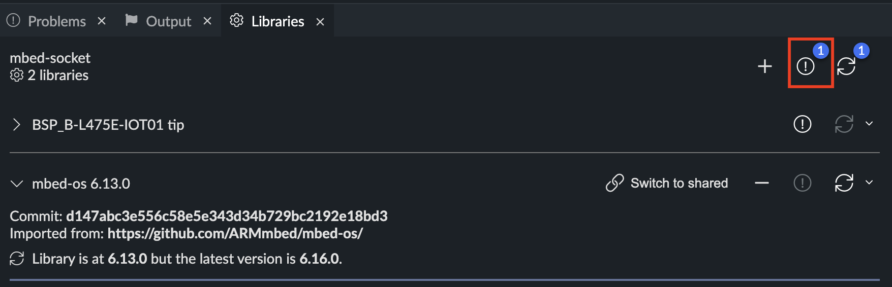
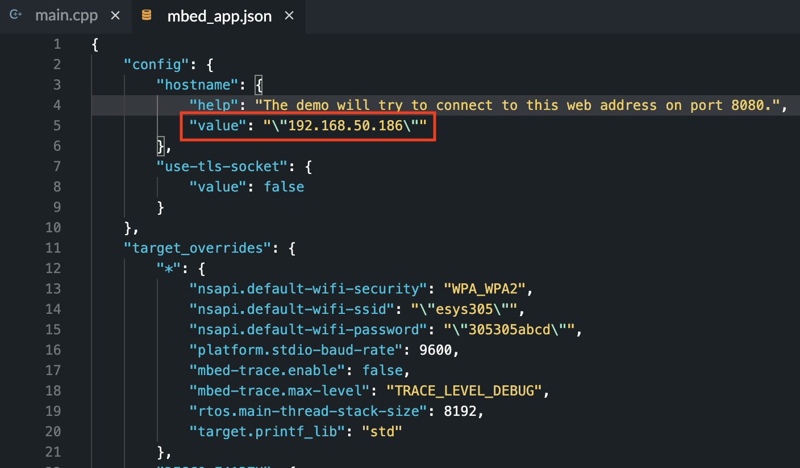

# HW2 Socket Communication

## Installation

### Clone the repository

```bash
git clone https://github.com/ESlab2022/hw2.git
cd hw2
```

### Install Python3 requirements

Python Version: 3.9.13

Create and activate new environment called "venv"

```bash
cd server
python3 -m venv venv
source venv/bin/activate
```

Install packages

```bash
pip3 install -r requirements.txt
```

## Usage

### Flask server side

```bash
cd server
source venv/bin/activate
python3 server.py
```

Then you will see the flaks web server running in the terminal.

### STM Side

1. Open Mbed Studio.
2. Clik "Open WorkerSpave".
   
3. Select the cloned repo "hw2".
   
4. Click "Fix Problem" to install necessary dependencies.
   
5. Change the hostname.
   
6. Change the WIFI SSID and password.
   
7. Build and run the program.

### Demo

<video src="docs/full_demo.mp4"></video>
